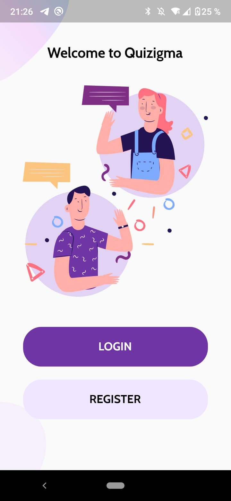
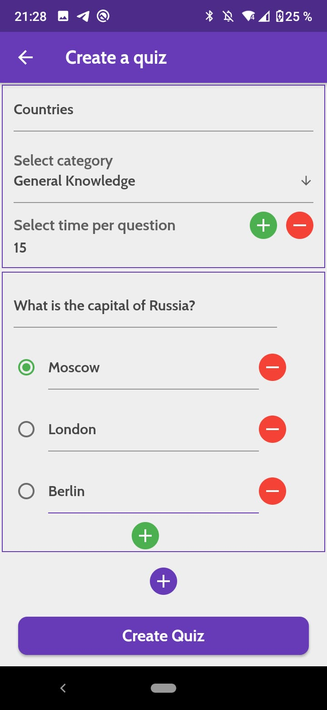
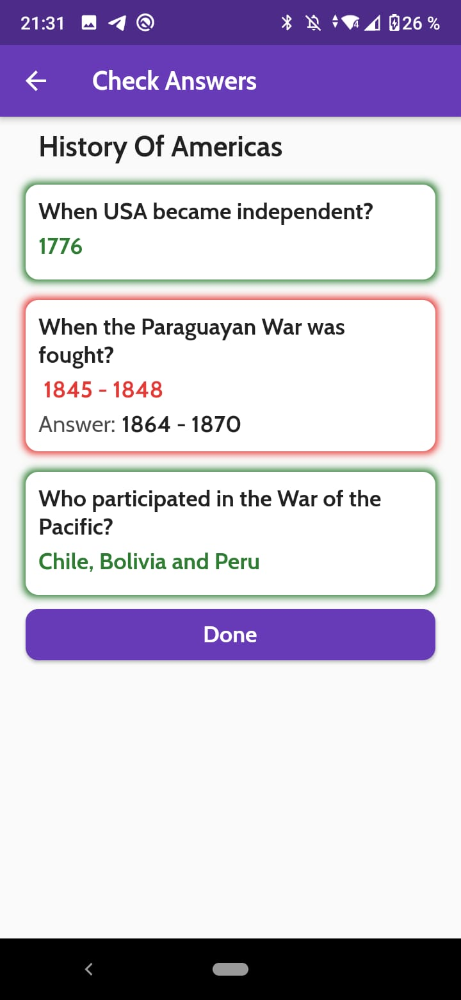
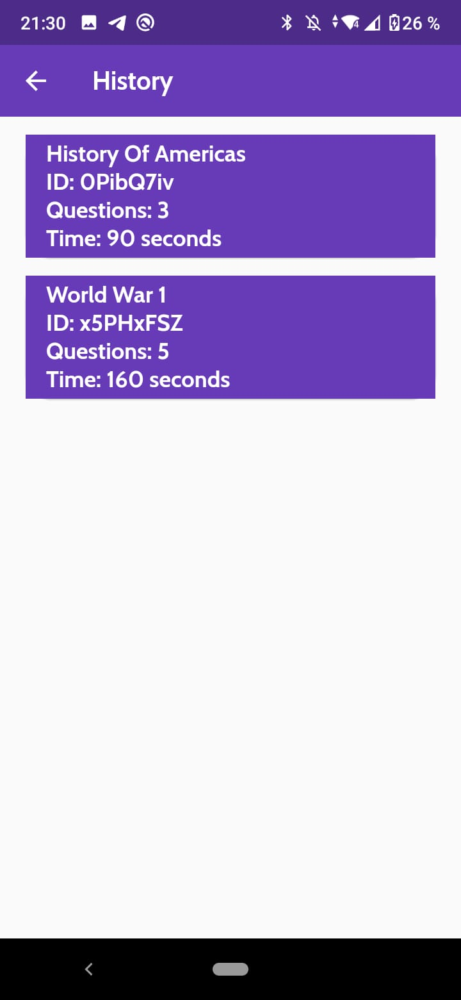
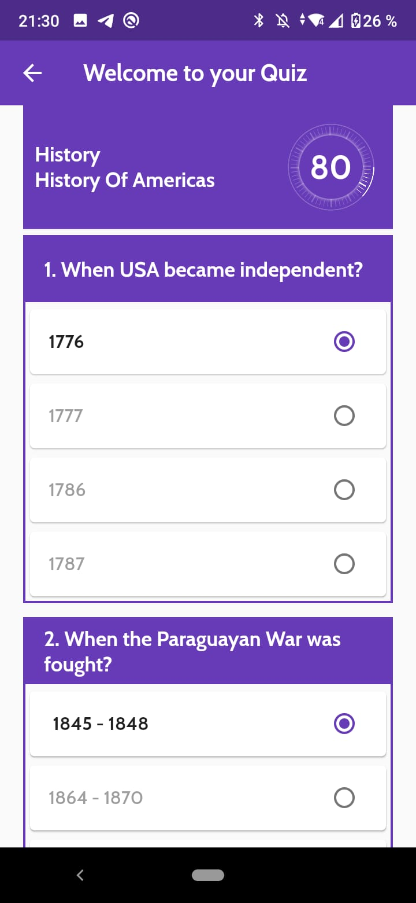

# Quizigma

Quizigma is a project developed by the students of Computer Science from the Technische Hochschule Ulm during the Winter Semester of 2020/2021. It is a quiz game that allows users to create its own quizes written entirely on Dart/Flutter.

