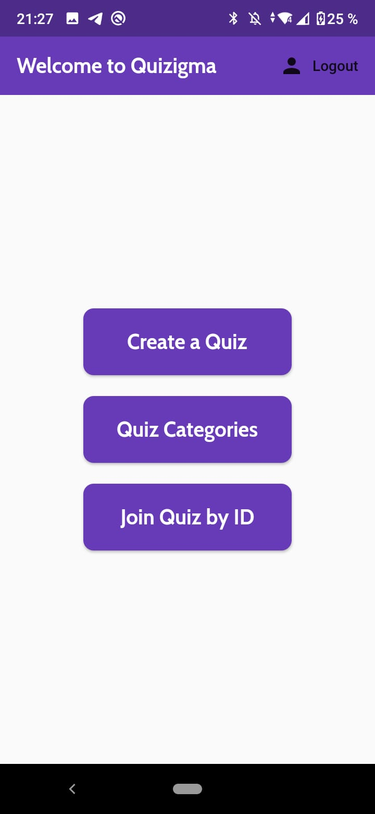
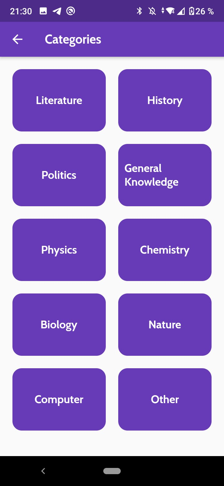

# Quizigma

Quizigma is a project developed by the students of Computer Science from the Technische Hochschule Ulm during the Winter Semester of 2020/2021. It is a quiz game that allows users to create its own quizes written entirely on Dart/Flutter.

Register an account screen.

Login screen.

Home screen.

Categories screen.

Creating a quiz.

Checking which answer is correct.

Id of the created to quiz to be shared with other players.

List of quizes inside a category.

Quiz player screen.

